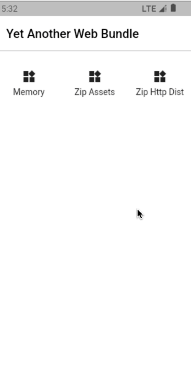

# <center>Yet ANOther Web Bundle</center>

开箱即用，App 内嵌 Webview 子应用的管理和加载工具。Web 子应用可以从内存、Zip 归档、互联网 Tar 归档、框架 Assets，甚至是任意的数据源获取。

| Memory                               | Flutter Assets                                 | Internet Assets                                |
| ------------------------------------ | ---------------------------------------------- | ---------------------------------------------- |
|  |  |  |

## 特性

- 开箱即用：内置常用的 Web Bundle 应用拉取、解码工具

- 快速上手：提供易用的 Facade，和易于扩展的组合自定义接口

- 高度自订：实现简单下载、解码功能即可构建属于自己的加载器。

- 缓存读写：支持缓存加载

## 安装

```yaml
# pubspec.yaml
dependencies:
  # ...
  yano_web_bundle: <latest version>
```

### 引入


```dart
import 'package:yano_web_bundle/yano_web_bundle.dart';
```

## 配置明文传输 (Clear Text HTTP)

YANO Web Bundle 开启一个 Web 服务器为 WebView 提供静态文件服务，所以需要在主 App 允许 HTTP 明文传输。

### Android

```xml
<manifest ...>
    <uses-permission android:name="android.permission.INTERNET" />
    <application
        ...
        android:usesCleartextTraffic="true"
        ...>
        ...
    </application>
</manifest>
```

> [https://stackoverflow.com/questions/45940861/android-8-cleartext-http-traffic-not-permitted](https://stackoverflow.com/questions/45940861/android-8-cleartext-http-traffic-not-permitted)


## iOS

> [https://stackoverflow.com/questions/31254725/transport-security-has-blocked-a-cleartext-http](https://stackoverflow.com/questions/31254725/transport-security-has-blocked-a-cleartext-http)


## 示例：内存中的 App

新建内存中的文件系统，并作为 WebView App 加载。

```dart
// define in-memory facade
final facade = BundleFacade.memory({
  "index.html": utf8.encode('...'),
  "index.js": utf8.encode("..."),
});

// fetch bundle
late Bundle bundle;
await facade.fetch(Uri.base).then((bun) => bundle = bun);

// serve bundle
await facade.serve(bundle, InternetAddress.loopbackIPv4);

// get serving port and construct app url for webview
final port = facade.getServingPort(bundle);
final index_html = "http://localhost:${port}/index.html";
final index_js = "http://localhost:${port}/index.js";
```

## 示例：互联网上以 zip 分发的 App

```dart
final facade = BundleFacade(HttpFetcher(), ZipBundleDecoder());

// fetch bundle
late Bundle bundle;
await facade.fetch(
  "https://example.org/my-app.zip",
  onProgress: (status) => {...}
).then((bun) => bundle = bun);

// cancel download bundle
facade.cancelFetch("https://example.org/my-app.zip");
```

## Acknowledgement

Demo Archive Source: [https://github.com/1983shiv/tic-tac-toe-game-vuejs](https://github.com/1983shiv/tic-tac-toe-game-vuejs)

## LICENSE

MIT 2023-present, Luo3House.
